<h1 align="center">
  <picture>
    <source media="(prefers-color-scheme: dark)" srcset="docs/banner-dark.svg">
    <source media="(prefers-color-scheme: light)" srcset="docs/banner-light.svg">
    
  </picture>
</h1>

<p align="center">
  <a href="https://github.com/lutzashl290788-cell/farvater/releases/latest"></a>
  <a href="https://github.com/lutzashl290788-cell/farvater/releases"></a>
  <a href="https://github.com/lutzashl290788-cell/farvater/actions/workflows/build.yml"></a>
  <a href="LICENSE"></a>
  
</p>

<p align="center">
  VLESS, VMess, Trojan и Shadowsocks на ядре Xray.<br>
  <b>Вставили подписку, нажали кнопку, работает.</b>
</p>

<p align="center">
  <a href="https://github.com/lutzashl290788-cell/farvater/releases/latest"></a>
  <a href="https://apps.obtainium.imranr.dev/redirect?r=obtainium%3A%2F%2Fadd%2Fhttps%3A%2F%2Fgithub.com%2Flutzashl290788-cell%2Ffarvater"></a>
</p>

<p align="center">
  <a href="#установка"><b>Установка</b></a>
  &nbsp;&middot;&nbsp;
  <a href="#как-пользоваться"><b>Как пользоваться</b></a>
  &nbsp;&middot;&nbsp;
  <a href="#безопасность"><b>Безопасность</b></a>
  &nbsp;&middot;&nbsp;
  <a href="#вопросы-и-ответы"><b>Вопросы</b></a>
  &nbsp;&middot;&nbsp;
  <a href="CHANGELOG.md"><b>Изменения</b></a>
</p>

<p align="center">
  <picture>
    <source media="(prefers-color-scheme: dark)" srcset="docs/showcase-dark.jpg">
    <source media="(prefers-color-scheme: light)" srcset="docs/showcase-light.jpg">
    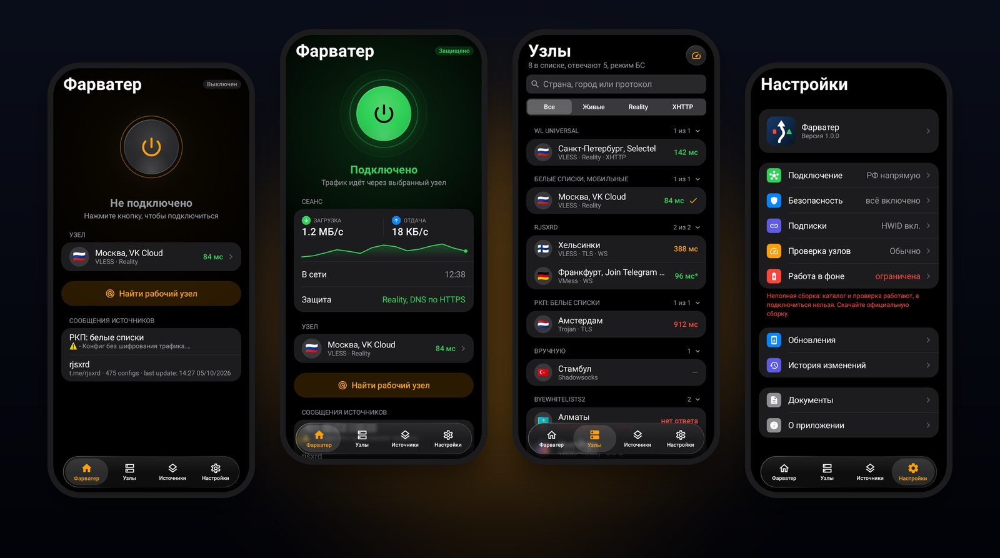
  </picture>
</p>

Фарватер пропускает трафик всех приложений через ваш сервер или сервер из публичной подписки. Нужна только ссылка на подписку, самый быстрый узел приложение найдёт само. Госуслуги, банки, Яндекс и VK при этом открываются напрямую, как без VPN.

Приложение бесплатное. Рекламы, аналитики и регистрации нет, исходный код открыт под лицензией GPL-3.0.

<details>
<summary><b>Содержание</b></summary>
<br>

- [Почему Фарватер](#почему-фарватер)
- [Возможности](#возможности)
- [Скриншоты](#скриншоты)
- [Установка](#установка)
  - [Обновления](#обновления)
- [Как пользоваться](#как-пользоваться)
  - [Первый запуск](#первый-запуск)
  - [Подписки](#подписки)
  - [Подключение и выбор узла](#подключение-и-выбор-узла)
  - [Импорт по ссылке](#импорт-по-ссылке)
  - [Настройки](#настройки)
- [Поддерживаемые протоколы](#поддерживаемые-протоколы)
- [Безопасность](#безопасность)
- [Конфиденциальность](#конфиденциальность)
- [Вопросы и ответы](#вопросы-и-ответы)
- [Для разработчиков](#для-разработчиков)
  - [Устройство приложения](#устройство-приложения)
  - [Сборка из исходников](#сборка-из-исходников)
  - [Выпуск версий](#выпуск-версий)
  - [Участие в разработке](#участие-в-разработке)
- [Благодарности](#благодарности)
- [Лицензия](#лицензия)

</details>

## Почему Фарватер

<table>
  <tr>
    <td width="33%" valign="top">
      <b>⚡ Одна кнопка</b><br><br>
      Вставили подписку и нажали кнопку. Разбираться в протоколах и транспортах не нужно.
    </td>
    <td width="33%" valign="top">
      <b>🧭 Узел найдётся сам</b><br><br>
      Фарватер проверяет все серверы и подключается к самому быстрому. Даже на сотнях узлов телефон не тормозит.
    </td>
    <td width="33%" valign="top">
      <b>🏦 Банки мимо VPN</b><br><br>
      Госуслуги, банки, Яндекс и VK идут напрямую. Банковское приложение можно исключить из VPN целиком.
    </td>
  </tr>
  <tr>
    <td valign="top">
      <b>🛡️ Безопасно сразу</b><br><br>
      DNS по HTTPS, локальный прокси под паролем, небезопасные узлы из публичных подписок скрыты. Ничего не нужно включать.
    </td>
    <td valign="top">
      <b>🔄 Обновления внутри</b><br><br>
      О новой версии придёт уведомление. Перед установкой APK сверяется по SHA-256 и подписи.
    </td>
    <td valign="top">
      <b>🎨 Три стиля</b><br><br>
      iOS 26 с живым стеклом Liquid Glass, Material You в цветах ваших обоев или #РосКомПозор в цветах #РКП.
    </td>
  </tr>
</table>

Обычный VPN-клиент для Android ждёт, что вы разбираетесь в протоколах, а с публичными подписками заставляет перебирать серверы руками. Фарватер сделан для того, у кого есть ссылка и нет времени разбираться.

Внутри то же ядро [Xray-core](https://github.com/XTLS/Xray-core), что и в v2rayNG, и тот же формат ссылок, поэтому подходят подписки от любых панелей. Своё у Фарватера всё, что вокруг ядра: быстрая проверка узлов, безопасные настройки по умолчанию, отдельная маршрутизация для российских сервисов и обновления прямо в приложении.

Своих серверов у Фарватера нет. Он ничего не продаёт и ничего не собирает.

## Возможности

**Подключение**

- Подключение одной кнопкой на главном экране.
- Плитка в шторке уведомлений: подключает выбранный узел и отключает VPN, не открывая приложение.
- «Найти рабочий узел»: приложение проверяет все серверы и выбирает самый быстрый из ответивших.
- Выбранный узел не меняется сам. Если он перестал отвечать, на главном экране и в уведомлении появится «Узел не отвечает».
- Статистика: скорость загрузки и отдачи, трафик за сеанс и за сегодня, время в сети и используемая защита. Скорость и трафик видны и в уведомлении.

**Подписки**

- Свои подписки по ссылке и отдельные узлы из буфера обмена.
- Каталог из семи публичных подписок от сообщества. По умолчанию выключен.
- Режимы сети: белые списки (БС) и чёрные списки (ЧС). У каждой подписки свой режим, а в режиме «Авто» Фарватер сам определяет, какие сейчас ограничения.
- Свой интервал обновления для каждой подписки, от раза в час до раза в сутки, или только вручную.
- HWID для панелей с ограничением числа устройств.
- Заголовки `profile-title` и `announce`. Объявления владельцев подписок показываются на главном экране.

**Проверка узлов**

- Два этапа: сначала быстрое TCP-соединение со всеми узлами, потом настоящий HTTP-запрос через ядро к тем, кто ответил.
- Три скорости проверки: бережная, обычная и быстрая.
- Пока идёт проверка, список не прыгает: результаты появляются пачками раз в 300 мс.
- Узлы сгруппированы по подпискам, группы сворачиваются.
- Поиск по стране, городу и протоколу, фильтры «Живые», Reality и XHTTP.

**Маршрутизация**

- Госуслуги, банки, Яндекс, VK, маркетплейсы и ещё около двадцати доменов идут напрямую.
- Любое приложение можно полностью исключить из VPN.
- Локальные сети (`10.0.0.0/8`, `192.168.0.0/16` и другие) в туннель не уходят.

**Интерфейс**

- Стиль iOS 26 с Liquid Glass: панель вкладок и шапки из живого стекла, которое размывает и преломляет всё под собой (Android 12 и новее, линза по краям с Android 13), переключатели и сегменты в форме капсул, окна с размытием фона. В режиме энергосбережения стекло сменяется сплошной подложкой.
- Стиль Material You: навигация, списки и переключатели Material 3, цвета под обои телефона на Android 12 и новее.
- Стиль #РосКомПозор: Material 3 в цветах #РКП, голубой акцент на тёмно-сером фоне, всегда тёмная тема и логотип #РКП на кнопке подключения.
- Тема как в системе, всегда светлая или всегда тёмная.
- Уведомление о новой версии со списком изменений и скачивание обновления внутри приложения.

## Скриншоты

<table>
  <tr>
    <td align="center" width="33%">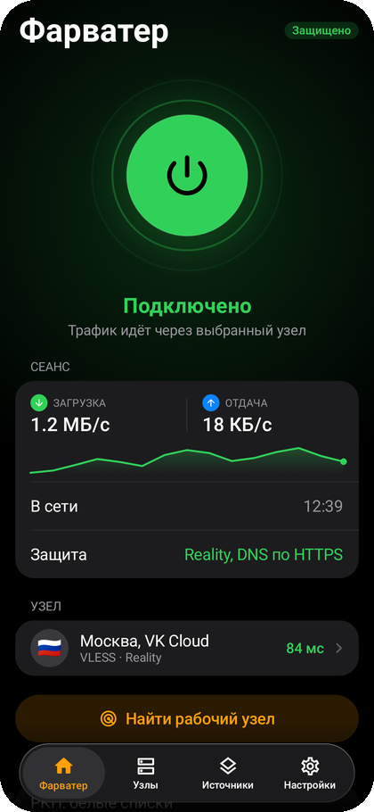<br><sub>Главный экран</sub></td>
    <td align="center" width="33%">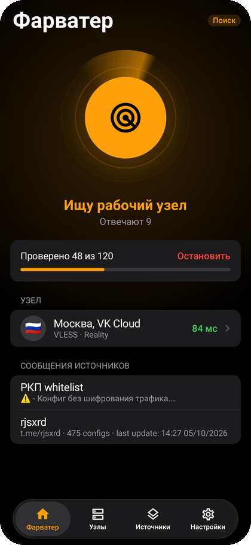<br><sub>Поиск рабочего узла</sub></td>
    <td align="center" width="33%">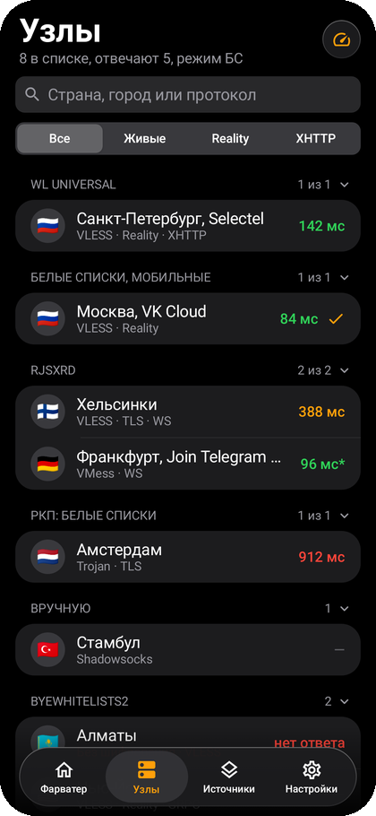<br><sub>Список узлов</sub></td>
  </tr>
  <tr>
    <td align="center">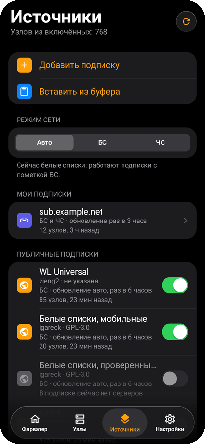<br><sub>Подписки</sub></td>
    <td align="center">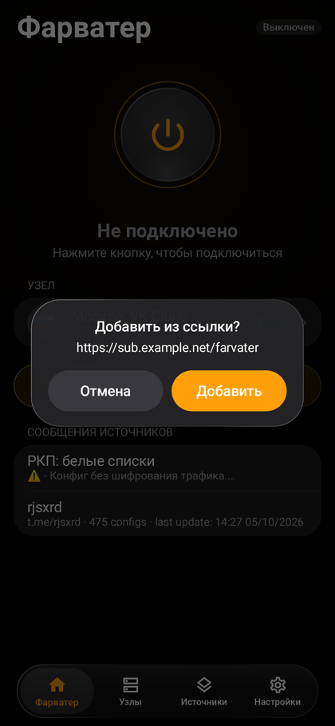<br><sub>Импорт по ссылке</sub></td>
    <td align="center">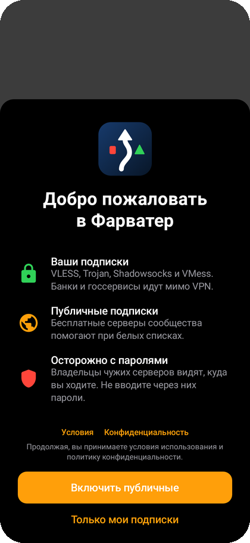<br><sub>Первый запуск</sub></td>
  </tr>
</table>

<details>
<summary><b>Светлая тема</b></summary>
<br>
<table>
  <tr>
    <td align="center" width="25%">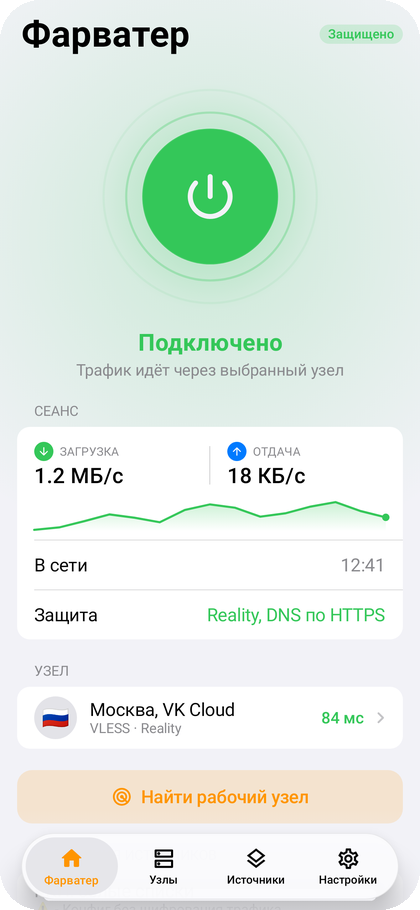<br><sub>Главный экран</sub></td>
    <td align="center" width="25%">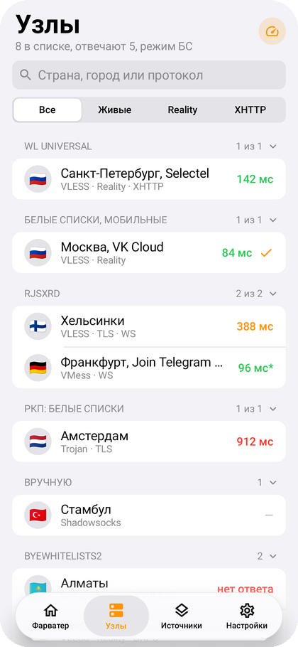<br><sub>Список узлов</sub></td>
    <td align="center" width="25%">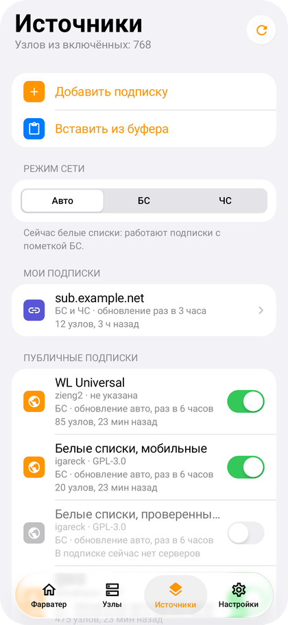<br><sub>Подписки</sub></td>
    <td align="center" width="25%">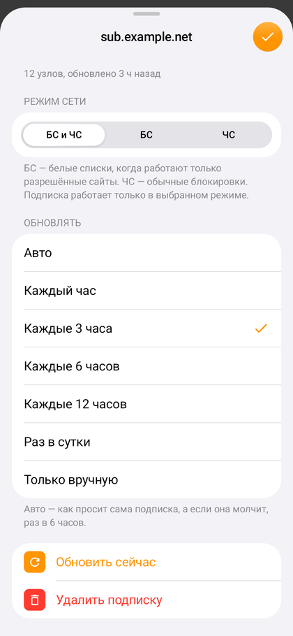<br><sub>Карточка подписки</sub></td>
  </tr>
</table>
</details>

<details>
<summary><b>Material You</b></summary>
<br>
<table>
  <tr>
    <td align="center" width="25%">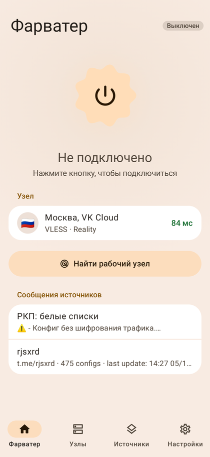<br><sub>Главный экран</sub></td>
    <td align="center" width="25%">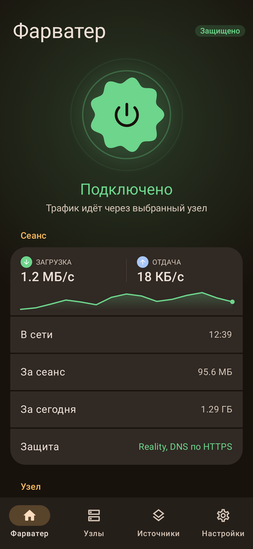<br><sub>Подключение</sub></td>
    <td align="center" width="25%">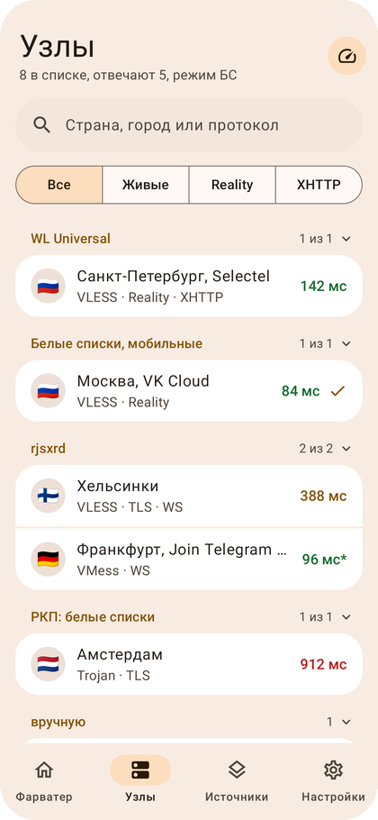<br><sub>Список узлов</sub></td>
    <td align="center" width="25%">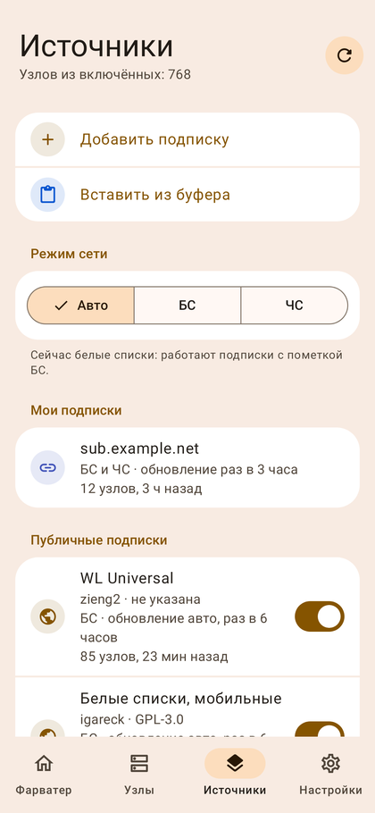<br><sub>Подписки</sub></td>
  </tr>
</table>
</details>

<details>
<summary><b>#РосКомПозор</b></summary>
<br>
<table>
  <tr>
    <td align="center" width="25%">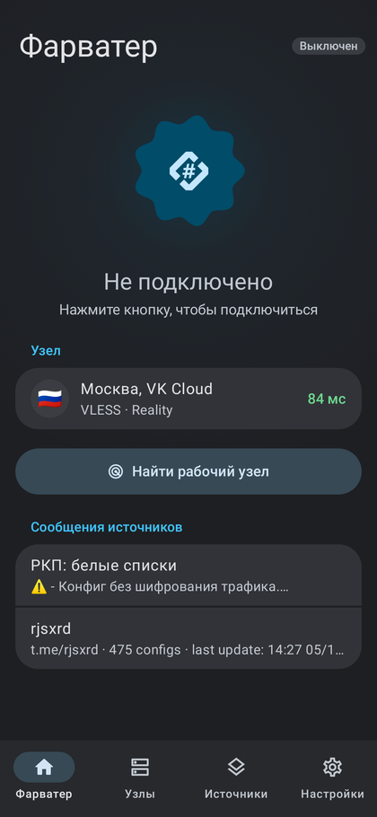<br><sub>Главный экран</sub></td>
    <td align="center" width="25%">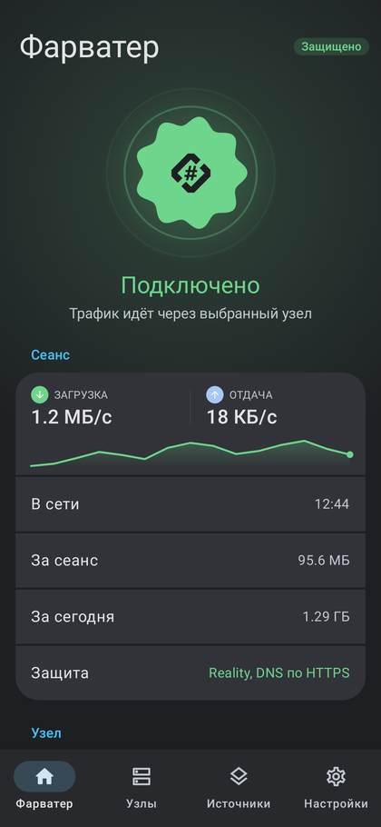<br><sub>Подключение</sub></td>
    <td align="center" width="25%">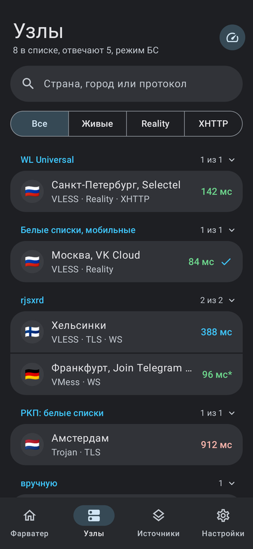<br><sub>Список узлов</sub></td>
    <td align="center" width="25%">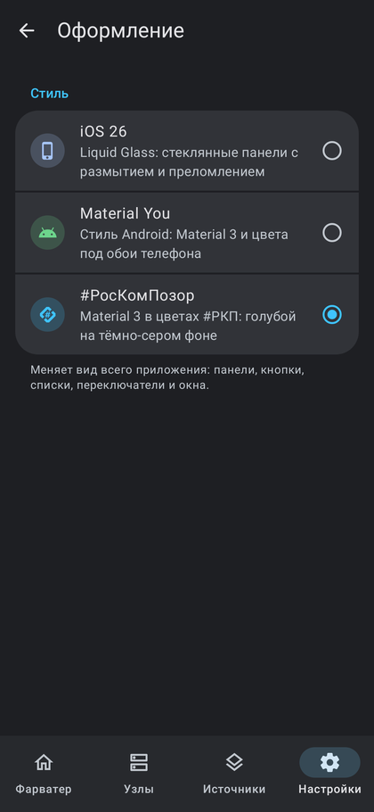<br><sub>Выбор стиля</sub></td>
  </tr>
</table>
</details>

## Установка

> [!WARNING]
> Фарватер распространяется только через [релизы на GitHub](https://github.com/lutzashl290788-cell/farvater/releases). В Google Play и других магазинах его нет, а копии на сторонних сайтах могут быть изменены.

1. Откройте [последний релиз](https://github.com/lutzashl290788-cell/farvater/releases/latest) с телефона.
2. Скачайте `Farvater-X.Y.Z-arm64-v8a.apk`. Он подходит почти всем телефонам.
3. Откройте скачанный файл. Если Android попросит разрешить установку из браузера или файлового менеджера, разрешите.
4. Запустите Фарватер и примите условия использования.

Нужен Android 8.0 или новее. Приложение попросит разрешения на VPN, уведомления и установку обновлений.

<details>
<summary><b>Какой файл скачать</b></summary>
<br>

| Файл | Для каких устройств |
| :-- | :-- |
| `Farvater-X.Y.Z-arm64-v8a.apk` | Большинство телефонов, выпущенных после 2017 года. Если сомневаетесь, начните с него. |
| `Farvater-X.Y.Z-armeabi-v7a.apk` | Старые и бюджетные телефоны с 32-битным процессором. |
| `Farvater-X.Y.Z-x86_64.apk` | Эмуляторы Android и Chromebook. |
| `Farvater-X.Y.Z-x86.apk` | Старые телефоны и планшеты на 32-битных процессорах Intel. |
| `Farvater-X.Y.Z-universal.apk` | Любое устройство. Файл в два раза больше остальных. |

</details>

<details>
<summary><b>Приложение не устанавливается</b></summary>
<br>

Чаще всего установку блокирует защита самого телефона, а не APK. Если ничего не помогает, скачайте `universal`.

| Телефон или сообщение | Что сделать |
| :-- | :-- |
| Samsung, «Действие заблокировано» | Настройки → Безопасность и конфиденциальность → **Автоблокировка** → выключить. |
| Xiaomi, Redmi, POCO | Разрешите установку из браузера или файлового менеджера, через который открываете APK. Если мешает проверка безопасности, отключите её на время установки в приложении «Безопасность». |
| Huawei, Honor, «Чистый режим» | Настройки → Система и обновления → **Чистый режим** (или «Безопасный режим») → выключить. |
| «Заблокировано Play Защитой» | Нажмите «Подробнее» → «Всё равно установить». |
| «Конфликт пакетов» или «Приложение не установлено» поверх старой версии | Раньше стояла сборка, подписанная другим ключом. Удалите её и установите заново. |
| «Ошибка при синтаксическом анализе пакета» | Android старше 8.0 не поддерживается. Если версия подходит, скачайте файл заново: он мог загрузиться не полностью. |

</details>

<details>
<summary><b>Как проверить, что файл настоящий</b></summary>
<br>

Все релизы подписаны одним ключом. Отпечаток сертификата SHA-256:

```
D8:80:FC:FE:51:D4:A3:06:A5:0F:B8:67:40:83:9D:74:75:37:53:D4:88:06:6B:27:E1:54:00:B5:42:BC:68:0F
```

Подпись скачанного файла проверяет утилита `apksigner` из Android SDK:

```sh
apksigner verify --print-certs Farvater-X.Y.Z-arm64-v8a.apk | grep SHA-256
```

К каждому релизу приложен `SHA256SUMS.txt` с контрольными суммами всех APK:

```sh
sha256sum --check --ignore-missing SHA256SUMS.txt
```

Если отпечаток не совпадает, не устанавливайте файл.

</details>

### Обновления

Фарватер проверяет новые версии раз в 15 минут: в фоне, при открытии приложения, а пока включён VPN, ещё и при включении экрана. Найдя новую, присылает уведомление, а в открытом приложении сразу показывает окно «Что нового». Срочные исправления помечены отдельно.

После нажатия «Обновить» приложение скачивает APK, сверяет SHA-256 с опубликованным, проверяет подпись и версию и только потом передаёт файл системному установщику. Настройки и подписки сохраняются.

Проверить вручную можно в **Настройки → Обновления → Проверить обновления**. Там же **История изменений** со всеми версиями начиная с 1.0.0. Она хранится внутри приложения и открывается без интернета.

Следить за версиями можно и через [Obtainium](https://github.com/ImranR98/Obtainium): кнопка вверху страницы добавит в него Фарватер. Описание и скриншоты для каталогов приложений лежат в `fastlane/metadata/android`.

> [!NOTE]
> Тестовые сборки из GitHub Actions подписаны другим ключом. Если у вас стоит такая сборка, удалите её перед установкой релиза, иначе Android не поставит новую версию поверх.

## Как пользоваться

### Первый запуск

Фарватер покажет условия использования и политику конфиденциальности и предложит выбор:

- **Включить публичные.** Включится каталог бесплатных подписок от сообщества. Подойдёт, если своего сервера нет.
- **Только мои подписки.** Каталог останется выключенным, подписку вы добавите сами.

Передумать можно в любой момент на вкладке «Источники».

### Подписки

На вкладке «Источники» два списка.

**Мои подписки.** Кнопка «Добавить подписку» принимает ссылку на подписку из панели: Marzban, 3x-ui, Remnawave и других. Кнопка «Вставить из буфера» понимает ссылку на подписку, одну или несколько ссылок на узлы (`vless://`, `vmess://`, `trojan://`, `ss://`) и содержимое подписки в Base64.

**Публичные подписки.** Восемь источников от сторонних авторов, у каждого свой переключатель. Под названием видны режим, интервал обновления, автор, лицензия, число узлов и время последнего обновления.

Вверху вкладки переключатель режима сети:

| Режим | Когда | Какие подписки работают |
| :-- | :-- | :-- |
| **БС** | Белые списки: мобильный интернет ограничен, открываются только разрешённые сайты вроде Госуслуг, банков, VK и Яндекса. Обычные серверы недоступны, нужны особые | С пометкой БС |
| **ЧС** | Чёрные списки, то есть обычные блокировки: закрыты отдельные сайты, остальное работает. Хватает обычных серверов | С пометкой ЧС |
| **Авто** | Фарватер сам проверяет, открываются ли зарубежные сайты, при открытии приложения и перед поиском узла | Подходящие к найденному режиму |

Белые списки включают на мобильном интернете, обычно на время ограничений связи в отдельных регионах. Домашний интернет под них не попадает.

Подписки не по режиму видны бледнее и в поиск узла не попадают. Подписки БС при обычных блокировках не используются: их авторы просят беречь эти серверы для тех, у кого белые списки. Ваши собственные подписки по умолчанию работают в обоих режимах.

Если нажать на подписку, откроется её карточка с режимом и интервалом обновления:

| Интервал | Когда обновляется |
| :-- | :-- |
| Авто | Как просит сама подписка в заголовке `profile-update-interval`, а если не просит, раз в 6 часов |
| Каждый час, 3, 6, 12 часов, раз в сутки | Через выбранное время после прошлого обновления |
| Только вручную | Только по кнопке «Обновить сейчас» |

Обновить все подписки сразу можно круглой кнопкой справа вверху или жестом сверху вниз.

### Подключение и выбор узла

Нажмите большую кнопку на главном экране. При первом подключении Android спросит разрешение на VPN.

Если выбранный узел не работает, нажмите **«Найти рабочий узел»**. Фарватер проверит все узлы из включённых подписок и подключится к самому быстрому. Прогресс видно на главном экране, проверку можно остановить.

Выбрать узел вручную можно на вкладке «Узлы». Нажатие на заголовок группы сворачивает её, кнопка справа вверху проверяет задержку всех узлов. Рядом с узлом видна задержка в миллисекундах или «нет ответа». Звёздочка после цифры значит, что узел проверен только TCP-соединением, без запроса через ядро.

### Импорт по ссылке

Сайт или бот могут открыть подписку сразу в Фарватере:

```
farvater://import?url=https%3A%2F%2Fexample.com%2Fsub%2Ftoken
```

Значение `url` должно быть закодировано, как в примере. Перед добавлением Фарватер покажет ссылку и спросит подтверждение.

### Настройки

Каждый раздел настроек открывается отдельной страницей. Всё, что влияет на безопасность, включено с самого начала.

<details>
<summary><b>Все настройки и значения по умолчанию</b></summary>
<br>

| Раздел | Параметр | По умолчанию | Что делает |
| :-- | :-- | :-- | :-- |
| Оформление | Стиль | iOS 26 | Вид всего приложения: iOS 26 с Liquid Glass, Material You или #РосКомПозор. |
| Оформление | Тема | как в системе | Светлая, тёмная или по настройке телефона. В стиле #РосКомПозор тема всегда тёмная. |
| Оформление | Цвета обоев | вкл. | Только для Material You на Android 12 и новее: цвета интерфейса подбираются под обои. |
| Подключение | Банки и госсервисы | вкл. | Сайты российских сервисов и банков открываются напрямую, мимо VPN. |
| Подключение | Приложения мимо VPN | нет | Отмеченные приложения ходят в интернет напрямую. Изменения применяются сразу. |
| Подключение | MTU | 8500 | Самый большой пакет в туннеле: 8500, 1500, 1480, 1400 или 1280. Понизьте, если в играх, звонках или отдельных приложениях что-то не работает. |
| Безопасность | Только защищённые узлы | вкл. | Скрывает в публичных подписках узлы без шифрования, со старым шифрованием или без проверки сертификата. На ваши подписки не влияет. |
| Безопасность | Зашифрованный DNS | вкл. | Адреса сайтов узнаются через DNS по HTTPS. |
| Подписки | Отправлять HWID | вкл. | Передаёт идентификатор устройства вашим подпискам. Публичные его не получают. |
| Проверка узлов | Скрывать неработающие | выкл. | Убирает из списка узлы без ответа. |
| Проверка узлов | Убирать дубли | выкл. | Оставляет один узел на адрес, порт и протокол: подписки иногда дают один сервер несколько раз с разными настройками. |
| Проверка узлов | Адрес проверки | Google | Что открывается через узел при проверке: Google, Cloudflare или Apple. |
| Проверка узлов | Скорость проверки | обычно | Сколько узлов проверяется одновременно: 8, 16 или 32. |
| Работа в фоне | Ограничения батареи | — | Показывает, ограничивает ли Android работу Фарватера, и открывает его страницу в настройках системы. |
| Обновления | Проверять автоматически | вкл. | Проверка обновлений раз в 15 минут. |

</details>

## Поддерживаемые протоколы

| Протокол | Транспорт | Шифрование | Статус |
| :-- | :-- | :-- | :-- |
| VLESS | TCP, WebSocket, gRPC, HTTPUpgrade, XHTTP | TLS, Reality | ✅ |
| VMess | TCP, WebSocket, gRPC, HTTPUpgrade, XHTTP | TLS | ✅ |
| Trojan | TCP, WebSocket, gRPC, HTTPUpgrade, XHTTP | TLS | ✅ |
| Shadowsocks | TCP | AEAD, Shadowsocks 2022 | ✅ |
| Hysteria2 | — | — | распознаётся, подключение пока не поддерживается |

Подписка может быть списком ссылок по одной на строку или тем же списком в Base64. Название и объявление берутся из HTTP-заголовков `profile-title` и `announce` или из строк `#profile-title: ...` и `#announce: ...` в теле подписки.

## Безопасность

VPN защищает трафик на участке от телефона до сервера. Дальше всё зависит от сервера. Фарватер закрывает типичные дыры на стороне телефона, но сделать безопасным чужой сервер не может.

| Что делает Фарватер | От чего защищает |
| :-- | :-- |
| DNS по HTTPS через узел (1.1.1.1, 8.8.8.8) | Ни сервер, ни сети после него не подсмотрят и не подменят DNS-ответы. |
| Локальный SOCKS5 со случайным паролем, без входа по SOCKS4 и HTTP без пароля | Другие приложения на телефоне, в том числе исключённые из VPN, не подключатся к туннелю напрямую и не вычислят через него адрес сервера. |
| UDP через локальный прокси привязан к заранее объявленному порту | Чужое приложение не перехватит UDP-канал туннеля, даже если угадает порт. |
| Скрытие небезопасных узлов в публичных подписках | Узлы без шифрования, с отключённой проверкой сертификата (`allowInsecure`) и с устаревшими методами Shadowsocks не попадают в список. |
| Пометка «без шифрования» | Если такой узел есть в вашей подписке, вы это видите. |
| Сверка SHA-256, подписи и версии обновлений | Подменённый APK не установится, даже если подменили и контрольную сумму. |
| Проверка адресов подписок | Подписка не обратится к самому телефону, не перейдёт с https на http и не унесёт HWID на чужой сайт через перенаправление. |
| Подпись релизов одним ключом | Android не даст поставить поверх Фарватера чужую сборку. |

> [!CAUTION]
> **Чего Фарватер сделать не может**
> - Владелец сервера видит ваш IP-адрес, время подключения, объём трафика и адреса сайтов. Содержимое HTTPS ему недоступно.
> - Публичные серверы держат неизвестные люди. Не вводите через них пароли на сайтах без HTTPS и не входите в важные аккаунты.
> - Сервисы из списка исключений работают напрямую и видят ваш настоящий IP-адрес.

> [!IMPORTANT]
> Об уязвимостях пишите на почту, а не в открытые issues. Порядок описан в [SECURITY.md](SECURITY.md).

## Конфиденциальность

Фарватер не собирает данные и ничего не отправляет разработчику. У приложения нет своих серверов, аналитики, рекламы и отчётов об ошибках.

Вот все сетевые запросы, которые делает само приложение:

| Куда | Зачем | Что передаётся |
| :-- | :-- | :-- |
| Адреса ваших подписок | Загрузка списка узлов | `User-Agent: Farvater/X.Y.Z`. Если включён HWID, ещё `x-hwid`, `x-device-os`, `x-ver-os`, `x-device-model`. |
| Адреса публичных подписок (GitHub и другие) | Загрузка списка узлов | Только `User-Agent` |
| `www.gstatic.com/generate_204` | Проверка узла | Запрос идёт через проверяемый узел |
| GitHub, `raw.githubusercontent.com`, `cdn.jsdelivr.net` | Проверка обновлений | Только `User-Agent` |

HWID — это случайный UUID, который Фарватер создаёт при установке. Он не связан с IMEI, серийным номером или аккаунтом Google и исчезает при удалении приложения.

Полный текст: [политика конфиденциальности](legal/privacy.txt).

## Вопросы и ответы

<details>
<summary><b>Почему Фарватера нет в Google Play?</b></summary>
<br>

Google Play удаляет такие приложения по требованию регуляторов, а в некоторых странах магазин их не показывает. Релизы на GitHub от этого не зависят, а обновления приходят прямо в приложение.

</details>

<details>
<summary><b>Есть ли Фарватер для iPhone?</b></summary>
<br>

Нет. Для VPN-приложения на iOS Apple требует платный аккаунт разработчика, а публиковать такие приложения в App Store разрешает только организациям.

Подписки из Фарватера подходят и для клиентов на ядре Xray для iPhone, например Happ, Streisand или v2RayTun. Скопируйте ссылку на подписку и добавьте её в приложение. Часть этих клиентов убрана из российского App Store, их можно скачать с зарубежного Apple ID. Это сторонние приложения, Фарватер за них не отвечает.

</details>

<details>
<summary><b>Подписка показывает меньше узлов, чем должна</b></summary>
<br>

Панели с ограничением устройств без HWID отдают урезанный список. Включите **Настройки → Подписки → Отправлять HWID** и обновите подписку.

В публичных подписках часть узлов скрывает параметр «Только защищённые узлы». Сколько узлов скрыто и почему, написано в карточке подписки на вкладке «Источники».

</details>

<details>
<summary><b>VPN подключён, но сайты не открываются</b></summary>
<br>

Узел мог перестать работать. Тогда на главном экране и в уведомлении будет написано «Узел не отвечает». Выберите другой узел или нажмите «Найти рабочий узел». Сам Фарватер выбранный узел не меняет.

</details>

<details>
<summary><b>VPN отключается, когда приложение закрыто</b></summary>
<br>

Откройте **Настройки → Работа в фоне → Открыть настройки Фарватера** и выберите «Батарея» → «Без ограничений». На телефонах Xiaomi, Huawei, Honor, OPPO и vivo этого бывает мало: найдите Фарватер в настройках телефона, включите автозапуск, а в разделе батареи выберите «Без ограничений».

</details>

<details>
<summary><b>Телефон греется или сеть пропадает во время проверки узлов</b></summary>
<br>

Поставьте **Скорость проверки → Бережно**. Некоторые операторы сбрасывают соединения, когда телефон открывает много подключений одновременно.

</details>

<details>
<summary><b>Можно ли добавить подписку в каталог или убрать её оттуда?</b></summary>
<br>

Да. Напишите на почту из раздела [Лицензия](#лицензия). Авторы подписок могут попросить убрать свою ссылку, это будет сделано в ближайшем обновлении.

</details>

## Для разработчиков

### Устройство приложения

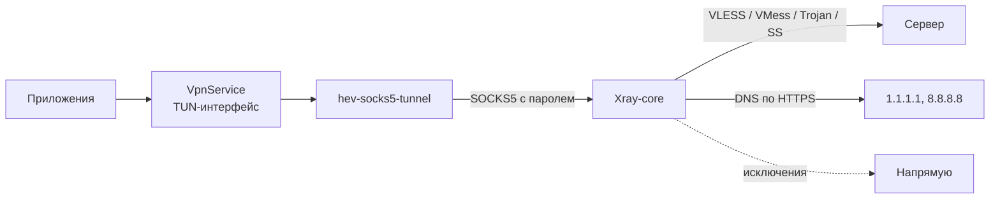

1. Android направляет трафик всех приложений, кроме исключённых, в виртуальный интерфейс TUN.
2. [hev-socks5-tunnel](https://github.com/heiher/hev-socks5-tunnel), нативная библиотека на C, разбирает IP-пакеты и превращает их в SOCKS5-соединения к локальному порту.
3. [Xray-core](https://github.com/XTLS/Xray-core) принимает соединения, проверяет пароль и по правилам маршрутизации отправляет их на сервер, напрямую или в DNS.

| Компонент | Версия | Где |
| :-- | :-- | :-- |
| Xray-core (AndroidLibXrayLite) | 26.9.30 | `app/libs/libv2ray.aar` |
| hev-socks5-tunnel | 2.18.0 | собирается из исходников через NDK |
| Kotlin | 2.2.0 | |
| Jetpack Compose BOM | 2025.07.00 | |
| Android Gradle Plugin | 8.11.1 | |

<details>
<summary><b>Структура исходного кода</b></summary>
<br>

```
app/src/main/java/app/farvater/
├── core/
│   ├── catalog/    каталог публичных подписок
│   ├── model/      модель узла, классификация безопасности
│   ├── parser/     разбор ссылок и подписок
│   └── xray/       конфигурация Xray, пароль локального прокси
├── data/           настройки, загрузка подписок, обновления
├── engine/         запуск Xray, TUN-мост, проверка узлов
├── vpn/            VpnService и плитка в шторке
└── ui/             экраны, навигация, тема, компоненты
legal/              условия, политика конфиденциальности, лицензии
scripts/            загрузка ядра, сборка TUN-моста, update.json
```

</details>

### Сборка из исходников

Понадобятся JDK 17, Android SDK с платформой 36, Android NDK 27.2.12479018, Gradle 8.14 и [GitHub CLI](https://cli.github.com) для загрузки ядра Xray.

```sh
git clone https://github.com/lutzashl290788-cell/farvater.git
cd farvater

export ANDROID_NDK_HOME="$ANDROID_SDK_ROOT/ndk/27.2.12479018"
./scripts/fetch-natives.sh

gradle :app:testDebugUnitTest :app:assembleDebug
```

Скрипт `fetch-natives.sh` скачивает `libv2ray.aar` из релиза AndroidLibXrayLite и собирает `libhev-socks5-tunnel.so` для четырёх архитектур. Готовые APK появятся в `app/build/outputs/apk/debug/`.

> [!TIP]
> Без нативных библиотек приложение соберётся, но подключиться не сможет: в настройках появится пометка «Неполная сборка».

**Релизная сборка.** Скопируйте `keystore.properties.example` в `keystore.properties` и укажите путь к ключу и пароль. Вместо файла можно задать переменные окружения `FARVATER_KEYSTORE` и `FARVATER_KEYSTORE_PASSWORD`.

```sh
gradle :app:assembleRelease -PfarvaterVersion=1.0.0
```

**Тесты.** Модульные тесты разбора подписок: `gradle :app:testDebugUnitTest`. Скриншоты экранов снимает Roborazzi: `gradle :app:recordRoborazziDebug`, на GitHub они сохраняются в ветку `screenshots`.

### Выпуск версий

Версии нумеруются по схеме `MAJOR.MINOR.PATCH`. Внутренний `versionCode` считается как `MAJOR × 10000 + MINOR × 100 + PATCH`: у версии 1.2.3 он равен 10203.

1. Впишите изменения в `release-notes.txt`. Строки, которые начинаются с `- `, попадут в окно обновления. Для срочного исправления добавьте строку `#critical`.
2. Обновите [CHANGELOG.md](CHANGELOG.md).
3. Отправьте тег `vX.Y.Z` или ветку `release/vX.Y.Z`.

Workflow [release.yml](.github/workflows/release.yml) соберёт и подпишет APK, посчитает контрольные суммы, опубликует релиз и положит `update.json` в ветку `updates`. Из этого файла установленные копии Фарватера узнают о новой версии.

### Участие в разработке

Об ошибках и идеях пишите в [issues](https://github.com/lutzashl290788-cell/farvater/issues). Перед pull request прочитайте [CONTRIBUTING.md](CONTRIBUTING.md): там стиль кода, проверки и требования к изменениям.

## Благодарности

| Проект | Автор | Лицензия |
| :-- | :-- | :-- |
| [Xray-core](https://github.com/XTLS/Xray-core) | Project X | MPL-2.0 |
| [AndroidLibXrayLite](https://github.com/2dust/AndroidLibXrayLite) | 2dust | LGPL-3.0 |
| [hev-socks5-tunnel](https://github.com/heiher/hev-socks5-tunnel) | hev | MIT |
| [AndroidLiquidGlass](https://github.com/Kyant0/AndroidLiquidGlass) | Kyant | Apache-2.0 |

AndroidLiquidGlass подсказал подход к эффекту стекла: запись фона в слой, размытие и линзу на AGSL. На его основе написана своя реализация.

Спасибо авторам публичных подписок из каталога: [zieng2](https://github.com/zieng2/wl), [igareck](https://github.com/igareck/vpn-configs-for-russia), [whoahaow](https://github.com/whoahaow/rjsxrd), [РКП](https://hub.mos.ru/rkp/sub-roskompozor) и [ByeWhiteLists](https://byewhitelists.github.io/).

Логотип #РКП в стиле #РосКомПозор используется с разрешения [РКП](https://hub.mos.ru/rkp/sub-roskompozor).

Полный список библиотек и лицензий лежит в [legal/licenses.txt](legal/licenses.txt).

## Лицензия

[GPL-3.0](LICENSE) © 2026 [lutzashl290788-cell](https://github.com/lutzashl290788-cell)

Фарватер можно свободно использовать, изучать, изменять и распространять. Производные работы должны выходить под той же лицензией с открытым исходным кодом.

Документы: [условия использования](legal/terms.txt), [политика конфиденциальности](legal/privacy.txt), [лицензии стороннего ПО](legal/licenses.txt).

Связь: [injexor@proton.me](mailto:injexor@proton.me)
