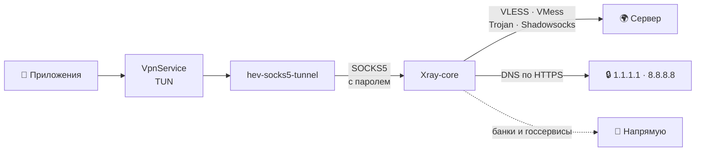

<div align="center">

<picture>
  <source media="(prefers-color-scheme: dark)" srcset="docs/banner-dark.svg">
  <source media="(prefers-color-scheme: light)" srcset="docs/banner-light.svg">
  
</picture>

<br>

[](https://github.com/lutzashl290788-cell/farvater/releases/latest)
[](https://github.com/lutzashl290788-cell/farvater/releases)
[](https://github.com/lutzashl290788-cell/farvater/actions/workflows/build.yml)
[](LICENSE)
<br>


<br>

<a href="https://github.com/lutzashl290788-cell/farvater/releases/latest">
  
</a>

<br><br>

**[Возможности](#-возможности)** · **[Скриншоты](#-скриншоты)** · **[Установка](#-установка)** · **[Безопасность](#-безопасность-и-приватность)** · **[Как это работает](#-как-это-работает)** · **[Сборка](#-сборка-из-исходников)** · **[Вопросы](#-вопросы-и-ответы)**

<br>

<picture>
  <source media="(prefers-color-scheme: dark)" srcset="docs/showcase-dark.jpg">
  <source media="(prefers-color-scheme: light)" srcset="docs/showcase-light.jpg">
  
</picture>

</div>

<br>

> **Фарватер** — бесплатный клиент с открытым кодом для подключения к серверам VLESS, VMess, Trojan и Shadowsocks. Добавьте свою подписку или включите публичные. Нажмите на маяк, и Фарватер сам найдёт узел, который работает прямо сейчас. Банки и госсервисы при этом открываются напрямую, без VPN.

<br>

## ✨ Возможности

<table>
<tr>
<td width="50%" valign="top">

### 🗼 Подключение в одно касание
Маяк на главном экране включает VPN. Кнопка «Найти рабочий узел» проверяет серверы и сама выбирает самый быстрый.

</td>
<td width="50%" valign="top">

### 📡 Свои и публичные подписки
Ссылки на подписки, ссылки на отдельные узлы, вставка из буфера. Каталог публичных подписок от сообщества включается одним переключателем.

</td>
</tr>
<tr>
<td valign="top">

### 🔄 Обновление подписок
Каждую подписку, свою или публичную, можно обновить отдельной кнопкой. Поддерживается HWID для панелей с лимитом устройств.

</td>
<td valign="top">

### ⚡ Быстрая проверка узлов
Сначала быстрая проверка соединения, потом настоящий запрос через ядро. Список не прыгает, интерфейс не тормозит даже на сотнях серверов.

</td>
</tr>
<tr>
<td valign="top">

### 🏦 Банки и госсервисы мимо VPN
Госуслуги, банки, Яндекс, VK и маркетплейсы открываются напрямую, как будто VPN выключен.

</td>
<td valign="top">

### 🛟 Переключение при сбое
Если узел трижды подряд не ответил, Фарватер сам переходит на следующий рабочий.

</td>
</tr>
<tr>
<td valign="top">

### 🔐 Защита по умолчанию
Зашифрованный DNS, локальный прокси под случайным паролем, предупреждения о серверах без шифрования.

</td>
<td valign="top">

### 🍏 Интерфейс в стиле iOS
Плавные анимации, капсульная панель вкладок, светлая и тёмная темы, крупные понятные элементы.

</td>
</tr>
<tr>
<td valign="top">

### 🔔 Обновления внутри приложения
Фарватер сам сообщает о новой версии и показывает, что изменилось. Скачанный файл сверяется по SHA-256 перед установкой.

</td>
<td valign="top">

### 🕊 Ничего лишнего
Без регистрации, рекламы, аналитики и трекеров. У Фарватера нет своих серверов, куда можно было бы что-то отправить.

</td>
</tr>
</table>

<br>

## 📸 Скриншоты

<div align="center">
<table>
<tr>
<td align="center"><br><sub><b>Подключено</b></sub></td>
<td align="center"><br><sub><b>Поиск рабочего узла</b></sub></td>
<td align="center"><br><sub><b>Узлы</b></sub></td>
</tr>
<tr>
<td align="center"><br><sub><b>Подписки</b></sub></td>
<td align="center"><br><sub><b>Настройки</b></sub></td>
<td align="center"><br><sub><b>Первый запуск</b></sub></td>
</tr>
</table>

<details>
<summary><b>☀️ Светлая тема</b></summary>
<br>
<table>
<tr>
<td align="center"><br><sub><b>Подключено</b></sub></td>
<td align="center"><br><sub><b>Узлы</b></sub></td>
<td align="center"><br><sub><b>Подписки</b></sub></td>
<td align="center"><br><sub><b>Настройки</b></sub></td>
</tr>
</table>
</details>
</div>

<br>

## 📥 Установка

1. Откройте **[последний релиз](https://github.com/lutzashl290788-cell/farvater/releases/latest)** с телефона.
2. Скачайте APK для своего процессора. Если не знаете какой, берите `universal`.
3. Откройте файл и разрешите установку из этого источника.
4. Запустите Фарватер, включите публичные подписки или добавьте свою и нажмите на маяк.

| Файл | Для каких устройств |
| :--- | :--- |
| `Farvater-X.Y.Z-arm64-v8a.apk` | 📱 Почти все телефоны последних лет — **подходит большинству** |
| `Farvater-X.Y.Z-armeabi-v7a.apk` | 📟 Старые и недорогие телефоны на 32-битных процессорах |
| `Farvater-X.Y.Z-x86_64.apk` | 💻 Эмуляторы и Chromebook |
| `Farvater-X.Y.Z-universal.apk` | 🧳 Любое устройство, файл просто больше по размеру |

> [!TIP]
> Фарватер можно добавить в **[Obtainium](https://github.com/ImranR98/Obtainium)** по ссылке на этот репозиторий, и он будет сам следить за новыми версиями.

<details>
<summary><b>🔏 Как проверить, что APK настоящий</b></summary>
<br>

Все релизы подписаны одним ключом. Отпечаток сертификата SHA-256:

```
D8:80:FC:FE:51:D4:A3:06:A5:0F:B8:67:40:83:9D:74:75:37:53:D4:88:06:6B:27:E1:54:00:B5:42:BC:68:0F
```

Проверить подпись:

```bash
apksigner verify --print-certs Farvater-1.0.0-universal.apk
```

Контрольные суммы всех файлов лежат в `SHA256SUMS.txt` рядом с APK:

```bash
sha256sum -c SHA256SUMS.txt --ignore-missing
```

</details>

<br>

## 🔔 Обновления

Фарватер раз в 12 часов проверяет, не вышла ли новая версия, и присылает уведомление со списком изменений. Срочные исправления помечаются отдельно. Обновление скачивается внутри приложения, сверяется по SHA-256 и ставится поверх старой версии, настройки и подписки остаются на месте.

Проверку можно выключить: **Настройки → О приложении → Проверять автоматически**.

<br>

## 🛡 Безопасность и приватность

| | Что сделано | Зачем |
| :---: | :--- | :--- |
| 🔒 | **Зашифрованный DNS** | Адреса сайтов узнаются по HTTPS, сервер не может подменить их или подсмотреть запросы |
| 🔑 | **Прокси под паролем** | Локальный SOCKS5 закрыт случайным паролем, другие приложения на телефоне не могут им пользоваться |
| 🚫 | **Только защищённые узлы** | В публичных подписках скрываются серверы без шифрования, со старым шифрованием или без проверки сертификата |
| ⚠️ | **Честные пометки** | Небезопасные узлы помечаются в списке надписью «без шифрования» |
| 🪪 | **HWID только для ваших подписок** | Публичные подписки его не получают, отправку можно выключить |
| 🕊 | **Никакой слежки** | Нет аналитики, рекламы, трекеров и отчётов об ошибках |

> [!IMPORTANT]
> Владелец сервера видит ваш IP-адрес и адреса сайтов, которые вы открываете. Содержимое HTTPS ему недоступно. Не вводите пароли на сайтах без замочка, особенно через публичные узлы.

Подробности — в **[политике конфиденциальности](legal/privacy.txt)**.

<br>

## 🧭 Как это работает



Android передаёт весь трафик в виртуальный сетевой интерфейс. **hev-socks5-tunnel** превращает его в SOCKS5-соединения, а **Xray-core** отправляет их на выбранный сервер или напрямую, если сайт в списке исключений.

<details>
<summary><b>🧩 Что поддерживается</b></summary>
<br>

| Протоколы | Транспорты | Защита |
| :--- | :--- | :--- |
| VLESS | TCP | TLS |
| VMess | WebSocket | Reality |
| Trojan | gRPC | |
| Shadowsocks | HTTPUpgrade | |
| | XHTTP | |

Подписки принимаются обычным списком ссылок или в Base64. Узлы Hysteria2 распознаются, но подключение к ним пока не поддерживается.

Подписку можно открыть в Фарватере прямо со страницы сайта:

```
farvater://import?url=https://example.com/sub
```

</details>

<br>

## 🛠 Сборка из исходников

Понадобятся **JDK 17**, **Android SDK**, **NDK 27.2.12479018**, **Gradle 8.14** и **[GitHub CLI](https://cli.github.com)**.

```bash
git clone https://github.com/lutzashl290788-cell/farvater
cd farvater

# ядро Xray и TUN-мост для arm64-v8a, armeabi-v7a и x86_64
export ANDROID_NDK_HOME="$ANDROID_SDK_ROOT/ndk/27.2.12479018"
./scripts/fetch-natives.sh

# отладочная сборка и тесты
gradle :app:testDebugUnitTest :app:assembleDebug
```

Готовые APK появятся в `app/build/outputs/apk/debug/`.

<details>
<summary><b>📦 Релизная сборка и выпуск версии</b></summary>
<br>

Для подписи скопируйте `keystore.properties.example` в `keystore.properties` и укажите путь к ключу и пароль. Либо задайте переменные окружения `FARVATER_KEYSTORE` и `FARVATER_KEYSTORE_PASSWORD`.

Выпуск новой версии:

1. Впишите изменения в `release-notes.txt` — каждая строка с `- ` попадёт в окно обновления. Для срочного исправления добавьте строку `#critical`.
2. Отправьте тег `vX.Y.Z` или ветку `release/vX.Y.Z`.
3. GitHub Actions соберёт и подпишет APK, посчитает контрольные суммы, опубликует релиз и обновит `update.json`, по которому приложения узнают о новой версии.

</details>

<details>
<summary><b>🗂 Структура проекта</b></summary>
<br>

```
app/src/main/java/app/farvater/
├── core/         разбор подписок и ссылок, конфигурация Xray
├── data/         настройки, подписки, обновления
├── engine/       ядро Xray, TUN-мост, проверка узлов
├── vpn/          VpnService
└── ui/           экраны, тема, компоненты в стиле iOS
legal/            соглашение, политика конфиденциальности, лицензии
scripts/          сборка нативных библиотек, update.json
```

</details>

<br>

## ❓ Вопросы и ответы

<details>
<summary><b>Почему Фарватера нет в Google Play?</b></summary>
<br>
Приложения такого рода там часто удаляют, а в некоторых странах они вообще недоступны. GitHub не зависит от этого, а обновления приходят прямо в приложение.
</details>

<details>
<summary><b>Подписка показывает меньше серверов, чем должна</b></summary>
<br>
Проверьте, включена ли отправка HWID: <b>Настройки → Подписки → Отправлять HWID</b>. Панели с лимитом устройств без него могут отдавать урезанный список. Затем обновите подписку кнопкой на вкладке «Источники».
</details>

<details>
<summary><b>Узел подключается, но сайты не открываются</b></summary>
<br>
Нажмите «Найти рабочий узел» — Фарватер проверит серверы и выберет тот, что отвечает сейчас. Включите «Переключаться при сбое», чтобы это происходило само.
</details>

<details>
<summary><b>Не ставится обновление поверх старой версии</b></summary>
<br>
Если раньше стояла тестовая сборка, она подписана другим ключом. Удалите её и установите версию из релиза — дальше обновления будут ставиться поверх.
</details>

<details>
<summary><b>Кому принадлежат публичные серверы?</b></summary>
<br>
Их авторам. Фарватер хранит только ссылки на публичные подписки. Поддержите авторов на страницах их проектов.
</details>

<br>

## 🙏 Благодарности

Фарватер построен на открытом коде:

- **[Xray-core](https://github.com/XTLS/Xray-core)** — Project X, ядро подключения
- **[AndroidLibXrayLite](https://github.com/2dust/AndroidLibXrayLite)** — 2dust, сборка Xray для Android
- **[hev-socks5-tunnel](https://github.com/heiher/hev-socks5-tunnel)** — hev, быстрый TUN-мост
- Авторы публичных подписок, которые делятся серверами

Полный список библиотек и их лицензий — в **[licenses.txt](legal/licenses.txt)**.

<br>

## 📄 Лицензия

Фарватер распространяется по лицензии **[GNU GPL v3.0](LICENSE)**. Вы можете пользоваться, изучать, менять и распространять его при условии, что производные работы тоже останутся открытыми.

[Пользовательское соглашение](legal/terms.txt) · [Политика конфиденциальности](legal/privacy.txt) · [Лицензии открытого ПО](legal/licenses.txt)

<br>

<div align="center">

**✉️ [injexor@proton.me](mailto:injexor@proton.me)**

<br>

<sub>Если Фарватер вам помог, поставьте ⭐ — так его проще найти другим.</sub>

</div>
