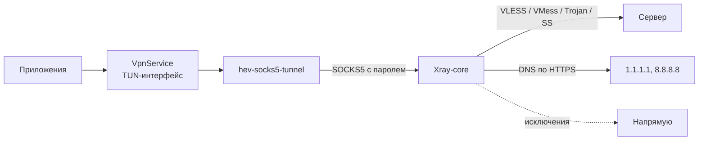

<h1 align="center">
  <picture>
    <source media="(prefers-color-scheme: dark)" srcset="docs/banner-dark.svg">
    <source media="(prefers-color-scheme: light)" srcset="docs/banner-light.svg">
    
  </picture>
</h1>

<p align="center">
  <a href="https://github.com/lutzashl290788-cell/farvater/releases/latest"></a>
  <a href="https://github.com/lutzashl290788-cell/farvater/releases"></a>
  <a href="https://github.com/lutzashl290788-cell/farvater/actions/workflows/build.yml"></a>
  <a href="LICENSE"></a>
  
</p>

<p align="center">
  Клиент для подключения к серверам VLESS, VMess, Trojan и Shadowsocks на Android. Работает на ядре Xray.
</p>

<p align="center">
  <a href="https://github.com/lutzashl290788-cell/farvater/releases/latest"><b>Скачать</b></a>
  &nbsp;&middot;&nbsp;
  <a href="#использование"><b>Как пользоваться</b></a>
  &nbsp;&middot;&nbsp;
  <a href="#безопасность"><b>Безопасность</b></a>
  &nbsp;&middot;&nbsp;
  <a href="CHANGELOG.md"><b>Изменения</b></a>
</p>

<p align="center">
  <picture>
    <source media="(prefers-color-scheme: dark)" srcset="docs/showcase-dark.jpg">
    <source media="(prefers-color-scheme: light)" srcset="docs/showcase-light.jpg">
    
  </picture>
</p>

Фарватер подключает телефон к вашему серверу или к серверу из публичной подписки и пропускает через него трафик всех приложений. Нужна только ссылка на подписку. Узел, который отвечает быстрее других, приложение найдёт само. Банковские приложения, Госуслуги, Яндекс и VK продолжают работать напрямую, как без VPN.

Приложение бесплатное, без рекламы, аналитики и регистрации. Исходный код открыт под лицензией GPL-3.0.

## Содержание

- [О проекте](#о-проекте)
- [Возможности](#возможности)
- [Скриншоты](#скриншоты)
- [Установка](#установка)
  - [Требования](#требования)
  - [Какой файл скачать](#какой-файл-скачать)
  - [Проверка подлинности](#проверка-подлинности)
  - [Обновление](#обновление)
- [Использование](#использование)
  - [Первый запуск](#первый-запуск)
  - [Подписки](#подписки)
  - [Подключение и выбор узла](#подключение-и-выбор-узла)
  - [Импорт по ссылке](#импорт-по-ссылке)
  - [Настройки](#настройки)
- [Поддерживаемые протоколы](#поддерживаемые-протоколы)
- [Безопасность](#безопасность)
- [Конфиденциальность](#конфиденциальность)
- [Устройство приложения](#устройство-приложения)
- [Сборка из исходников](#сборка-из-исходников)
- [Выпуск версий](#выпуск-версий)
- [Вопросы и ответы](#вопросы-и-ответы)
- [Участие в разработке](#участие-в-разработке)
- [Благодарности](#благодарности)
- [Лицензия](#лицензия)

## О проекте

Обычный VPN-клиент для Android требует много знать о протоколах и транспортах, а с публичными подписками мучает ручным перебором серверов. Фарватер задуман для человека, у которого есть ссылка и нет времени разбираться: вставил подписку, нажал на кнопку, всё работает.

Под капотом стоит то же ядро [Xray-core](https://github.com/XTLS/Xray-core), что и в v2rayNG, и тот же формат ссылок, поэтому подписки от любых панелей подходят без переделки. Своё у Фарватера то, что вокруг ядра: проверка узлов, которая не тормозит телефон на сотнях серверов, безопасные настройки по умолчанию, раздельная маршрутизация для российских сервисов и обновления прямо в приложении.

Своих серверов у Фарватера нет. Приложение ничего не продаёт и ничего не собирает.

## Возможности

**Подключение**

- Подключение одной кнопкой на главном экране.
- Поиск рабочего узла: приложение проверяет все серверы и выбирает самый быстрый из ответивших.
- Автоматический переход на другой узел, если текущий три раза подряд не ответил.
- Статистика сеанса: скорость загрузки и отдачи, время в сети, используемая защита.

**Подписки**

- Свои подписки по ссылке и отдельные узлы из буфера обмена.
- Каталог из шести публичных подписок от сообщества, выключен по умолчанию.
- Обновление любой подписки отдельной кнопкой, включая публичные.
- Поддержка HWID для панелей с ограничением числа устройств.
- Чтение заголовков `profile-title` и `announce`. Объявления от владельцев подписок показываются на главном экране.

**Проверка узлов**

- Проверка идёт в два этапа. Сначала быстрое TCP-соединение со всеми узлами, затем настоящий HTTP-запрос через ядро к тем, кто ответил.
- Три режима скорости: бережный, обычный и быстрый.
- Во время проверки список не перестраивается, результаты появляются пачками раз в 300 мс.
- Поиск по стране, городу и протоколу, фильтры «Живые», Reality и XHTTP.

**Маршрутизация**

- Госуслуги, банки, Яндекс, VK, маркетплейсы и ещё около двадцати доменов идут напрямую.
- Приложения Сбербанка, ВТБ, Т-Банка, Альфа-Банка и Ростелекома полностью исключены из VPN.
- Локальные сети (`10.0.0.0/8`, `192.168.0.0/16` и другие) не уходят в туннель.

**Интерфейс и обновления**

- Интерфейс в стиле iOS: капсульная панель вкладок, анимации на пружинах, светлая и тёмная темы.
- Проверка новых версий каждые 15 минут, уведомление со списком изменений.
- Скачивание обновления внутри приложения со сверкой SHA-256.

## Скриншоты

<table>
  <tr>
    <td align="center" width="33%"><br><sub>Главный экран</sub></td>
    <td align="center" width="33%"><br><sub>Поиск рабочего узла</sub></td>
    <td align="center" width="33%"><br><sub>Список узлов</sub></td>
  </tr>
  <tr>
    <td align="center"><br><sub>Подписки</sub></td>
    <td align="center"><br><sub>Настройки</sub></td>
    <td align="center"><br><sub>Первый запуск</sub></td>
  </tr>
</table>

<details>
<summary>Светлая тема</summary>
<br>
<table>
  <tr>
    <td align="center" width="25%"><br><sub>Главный экран</sub></td>
    <td align="center" width="25%"><br><sub>Список узлов</sub></td>
    <td align="center" width="25%"><br><sub>Подписки</sub></td>
    <td align="center" width="25%"><br><sub>Настройки</sub></td>
  </tr>
</table>
</details>

## Установка

Фарватер распространяется только через [релизы на GitHub](https://github.com/lutzashl290788-cell/farvater/releases). В Google Play и других магазинах его нет. Копии на сторонних сайтах могут быть изменены.

1. Откройте [последний релиз](https://github.com/lutzashl290788-cell/farvater/releases/latest) на телефоне.
2. Скачайте APK для своего процессора, таблица ниже.
3. Откройте скачанный файл. Android попросит разрешить установку из браузера или файлового менеджера — разрешите.
4. Запустите Фарватер и примите условия использования.

### Требования

| | |
| :-- | :-- |
| Android | 8.0 (API 26) и новее |
| Процессор | ARM64, ARMv7 или x86_64 |
| Разрешения | VPN, уведомления, установка обновлений |

### Какой файл скачать

| Файл | Устройства |
| :-- | :-- |
| `Farvater-X.Y.Z-arm64-v8a.apk` | Большинство телефонов, выпущенных после 2017 года. Если сомневаетесь, начните с него. |
| `Farvater-X.Y.Z-armeabi-v7a.apk` | Старые и бюджетные телефоны с 32-битным процессором. |
| `Farvater-X.Y.Z-x86_64.apk` | Эмуляторы Android и Chromebook. |
| `Farvater-X.Y.Z-universal.apk` | Любое устройство. Файл в два раза больше остальных. |

Если установщик пишет «Приложение не установлено», скорее всего, вы выбрали не тот процессор. Скачайте `universal`.

### Проверка подлинности

Все релизы подписаны одним ключом. Отпечаток сертификата SHA-256:

```
D8:80:FC:FE:51:D4:A3:06:A5:0F:B8:67:40:83:9D:74:75:37:53:D4:88:06:6B:27:E1:54:00:B5:42:BC:68:0F
```

Проверить подпись скачанного файла можно утилитой `apksigner` из Android SDK:

```sh
apksigner verify --print-certs Farvater-1.0.0-arm64-v8a.apk | grep SHA-256
```

К каждому релизу приложен `SHA256SUMS.txt` с контрольными суммами всех APK:

```sh
sha256sum --check --ignore-missing SHA256SUMS.txt
```

Если отпечаток не совпадает, не устанавливайте файл.

### Обновление

Фарватер сам проверяет новые версии каждые 15 минут и при каждом запуске, а найдя новую, присылает уведомление. В окне обновления видно, что изменилось. Срочные исправления помечаются отдельно. После нажатия «Обновить» приложение скачивает APK, сверяет его SHA-256 с опубликованным и передаёт системному установщику. Настройки и подписки сохраняются.

Проверить вручную: **Настройки → О приложении → Обновления**.

Следить за версиями можно и через [Obtainium](https://github.com/ImranR98/Obtainium): добавьте в него ссылку на этот репозиторий.

> [!NOTE]
> Тестовые сборки из GitHub Actions подписаны другим ключом. Если у вас стоит такая сборка, удалите её перед установкой релиза. Иначе Android откажется ставить новую версию поверх.

## Использование

### Первый запуск

При первом запуске Фарватер покажет условия использования и политику конфиденциальности, а затем предложит выбор:

- **Включить публичные** — включится каталог бесплатных подписок от сообщества. Подойдёт, если своего сервера нет.
- **Только мои подписки** — каталог останется выключенным, подписку вы добавите сами.

Выбор можно поменять в любой момент на вкладке «Источники».

### Подписки

Вкладка «Источники» состоит из двух списков.

**Мои подписки.** Кнопка «Добавить подписку» принимает ссылку на подписку из панели (Marzban, 3x-ui, Remnawave и других). Кнопка «Вставить из буфера» принимает ссылку на подписку, одну или несколько ссылок на узлы (`vless://`, `vmess://`, `trojan://`, `ss://`) или содержимое подписки в Base64.

**Публичные подписки.** Шесть источников от сторонних авторов, каждый включается своим переключателем. Под названием указаны автор, лицензия, число узлов и время последнего обновления.

При запуске Фарватер сам обновляет подписки, которые не обновлялись больше шести часов. Обновить все подписки вручную можно круглой кнопкой в правом верхнем углу или жестом сверху вниз. Чтобы обновить одну подписку, нажмите на неё и выберите «Обновить».

### Подключение и выбор узла

Нажмите на большую кнопку на главном экране. При первом подключении Android спросит разрешение на VPN.

Если выбранный узел не работает, нажмите **«Найти рабочий узел»**. Фарватер проверит все узлы из включённых подписок и подключится к самому быстрому. Прогресс видно на главном экране, проверку можно остановить.

Выбрать узел вручную можно на вкладке «Узлы». Кнопка в правом верхнем углу проверяет задержку всех узлов. Рядом с узлом видна задержка в миллисекундах или пометка «нет ответа». Звёздочка после цифры означает, что узел проверен только TCP-соединением, без запроса через ядро.

### Импорт по ссылке

Сайт или бот могут предложить открыть подписку сразу в Фарватере:

```
farvater://import?url=https%3A%2F%2Fexample.com%2Fsub%2Ftoken
```

Значение `url` должно быть закодировано, как в примере. Перед добавлением Фарватер покажет ссылку и спросит подтверждение.

### Настройки

| Раздел | Параметр | По умолчанию | Что делает |
| :-- | :-- | :-- | :-- |
| Подключение | Банки и госсервисы | вкл. | Российские сервисы и банковские приложения работают напрямую, мимо VPN. |
| Подключение | Переключаться при сбое | вкл. | Переход на другой узел после трёх неудачных проверок подряд. |
| Безопасность | Только защищённые узлы | вкл. | Скрывает в публичных подписках узлы без шифрования, со старым шифрованием или без проверки сертификата. На ваши подписки не влияет. |
| Безопасность | Зашифрованный DNS | вкл. | Адреса сайтов узнаются через DNS по HTTPS. |
| Безопасность | Прокси под паролем | всегда | Локальный SOCKS5-прокси закрыт случайным паролем. Не отключается. |
| Подписки | Отправлять HWID | вкл. | Передаёт идентификатор устройства вашим подпискам. Публичные его не получают. |
| Проверка узлов | Скрывать неработающие | выкл. | Убирает из списка узлы без ответа. |
| Проверка узлов | Скорость проверки | обычно | Сколько узлов проверяется одновременно: 8, 16 или 32. |
| Защита | Работа в фоне | — | Просит Android снять для Фарватера ограничения батареи, чтобы система не останавливала VPN. |
| Защита | Постоянный VPN | — | Открывает системные настройки Android, где включаются постоянный VPN и блокировка трафика без VPN. |
| О приложении | Проверять автоматически | вкл. | Фоновая проверка обновлений каждые 15 минут. |

## Поддерживаемые протоколы

| Протокол | Транспорт | Шифрование | Статус |
| :-- | :-- | :-- | :-- |
| VLESS | TCP, WebSocket, gRPC, HTTPUpgrade, XHTTP | TLS, Reality | поддерживается |
| VMess | TCP, WebSocket, gRPC, HTTPUpgrade, XHTTP | TLS | поддерживается |
| Trojan | TCP, WebSocket, gRPC, HTTPUpgrade, XHTTP | TLS | поддерживается |
| Shadowsocks | TCP | AEAD, Shadowsocks 2022 | поддерживается |
| Hysteria2 | — | — | распознаётся, подключение пока не поддерживается |

Подписка может быть списком ссылок, по одной на строку, или тем же списком в Base64. Название и объявление берутся из HTTP-заголовков `profile-title` и `announce` или из строк `#profile-title: ...` и `#announce: ...` в теле подписки.

## Безопасность

VPN защищает трафик на участке от телефона до сервера. Дальше всё зависит от сервера. Фарватер закрывает типичные дыры на стороне телефона, но не может сделать безопасным чужой сервер.

**Что делает Фарватер**

| Механизм | От чего защищает |
| :-- | :-- |
| DNS по HTTPS через узел (1.1.1.1, 8.8.8.8) | Ни сервер, ни сети после него не могут подсмотреть или подменить DNS-ответы. |
| Локальный SOCKS5 со случайным паролем | Другие приложения на телефоне не могут подключиться к туннелю напрямую и через него вычислить адрес сервера. |
| Скрытие небезопасных узлов в публичных подписках | Узлы без шифрования, с отключённой проверкой сертификата (`allowInsecure`) и с устаревшими методами Shadowsocks не попадают в список. |
| Пометка «без шифрования» | Если такой узел всё же есть в вашей подписке, вы это видите. |
| Сверка SHA-256 обновлений | Подменённый по пути APK не будет установлен. |
| Подпись релизов одним ключом | Android не даст поставить поверх Фарватера чужую сборку. |

**Что Фарватер сделать не может**

- Владелец сервера видит ваш IP-адрес, время подключения, объём трафика и адреса сайтов. Содержимое HTTPS ему недоступно.
- Публичные серверы держат неизвестные люди. Не вводите через них пароли на сайтах без HTTPS и не входите в важные аккаунты.
- Сервисы из списка исключений работают напрямую и видят ваш настоящий IP-адрес.

> [!IMPORTANT]
> Об уязвимостях пишите на почту, а не в открытые issues. Порядок описан в [SECURITY.md](SECURITY.md).

## Конфиденциальность

Фарватер не собирает данные и не отправляет их разработчику. У приложения нет своих серверов, аналитики, рекламы и отчётов об ошибках.

Сетевые запросы, которые делает само приложение:

| Куда | Зачем | Что передаётся |
| :-- | :-- | :-- |
| Адреса ваших подписок | Загрузка списка узлов | `User-Agent: Farvater/X.Y.Z`. Если включён HWID — ещё `x-hwid`, `x-device-os`, `x-ver-os`, `x-device-model`. |
| Адреса публичных подписок (GitHub и другие) | Загрузка списка узлов | Только `User-Agent` |
| `www.gstatic.com/generate_204` | Проверка узла | Запрос идёт через проверяемый узел |
| GitHub, `raw.githubusercontent.com`, `cdn.jsdelivr.net` | Проверка обновлений | Только `User-Agent` |

HWID — случайный UUID, который Фарватер создаёт при установке. Он не связан с IMEI, серийным номером или аккаунтом Google и пропадает при удалении приложения.

Полный текст: [политика конфиденциальности](legal/privacy.txt).

## Устройство приложения



1. Android направляет трафик всех приложений, кроме исключённых, в виртуальный интерфейс TUN.
2. [hev-socks5-tunnel](https://github.com/heiher/hev-socks5-tunnel) — нативная библиотека на C. Она разбирает IP-пакеты и превращает их в SOCKS5-соединения к локальному порту.
3. [Xray-core](https://github.com/XTLS/Xray-core) принимает соединения, проверяет пароль и по правилам маршрутизации отправляет их на сервер, напрямую или в DNS.

| Компонент | Версия | Где |
| :-- | :-- | :-- |
| Xray-core (AndroidLibXrayLite) | 26.9.30 | `app/libs/libv2ray.aar` |
| hev-socks5-tunnel | 2.18.0 | собирается из исходников через NDK |
| Kotlin | 2.2.0 | |
| Jetpack Compose BOM | 2025.07.00 | |
| Android Gradle Plugin | 8.11.1 | |

Структура исходного кода:

```
app/src/main/java/app/farvater/
├── core/
│   ├── catalog/    каталог публичных подписок
│   ├── model/      модель узла, классификация безопасности
│   ├── parser/     разбор ссылок и подписок
│   └── xray/       конфигурация Xray, пароль локального прокси
├── data/           настройки, загрузка подписок, обновления
├── engine/         запуск Xray, TUN-мост, проверка узлов
├── vpn/            VpnService
└── ui/             экраны, навигация, тема, компоненты
legal/              условия, политика конфиденциальности, лицензии
scripts/            загрузка ядра, сборка TUN-моста, update.json
```

## Сборка из исходников

Понадобятся:

- JDK 17
- Android SDK с платформой 36
- Android NDK 27.2.12479018
- Gradle 8.14
- [GitHub CLI](https://cli.github.com) для загрузки ядра Xray

```sh
git clone https://github.com/lutzashl290788-cell/farvater.git
cd farvater

export ANDROID_NDK_HOME="$ANDROID_SDK_ROOT/ndk/27.2.12479018"
./scripts/fetch-natives.sh

gradle :app:testDebugUnitTest :app:assembleDebug
```

Скрипт `fetch-natives.sh` скачивает `libv2ray.aar` из релиза AndroidLibXrayLite и собирает `libhev-socks5-tunnel.so` для трёх архитектур. Готовые APK появятся в `app/build/outputs/apk/debug/`.

Без нативных библиотек приложение соберётся, но подключиться не сможет: в настройках появится пометка «Неполная сборка».

**Релизная сборка.** Скопируйте `keystore.properties.example` в `keystore.properties` и укажите путь к ключу и пароль. Вместо файла можно задать переменные окружения `FARVATER_KEYSTORE` и `FARVATER_KEYSTORE_PASSWORD`.

```sh
gradle :app:assembleRelease -PfarvaterVersion=1.0.0
```

**Тесты.** Модульные тесты разбора подписок запускаются командой `gradle :app:testDebugUnitTest`. Скриншоты экранов снимает Roborazzi: `gradle :app:recordRoborazziDebug`. На GitHub они сохраняются в ветку `screenshots`.

## Выпуск версий

Версии нумеруются по схеме `MAJOR.MINOR.PATCH`. Внутренний `versionCode` считается как `MAJOR × 10000 + MINOR × 100 + PATCH`: у версии 1.2.3 он равен 10203.

1. Впишите изменения в `release-notes.txt`. Строки, которые начинаются с `- `, попадут в окно обновления. Для срочного исправления добавьте строку `#critical`.
2. Обновите [CHANGELOG.md](CHANGELOG.md).
3. Отправьте тег `vX.Y.Z` или ветку `release/vX.Y.Z`.

Workflow [release.yml](.github/workflows/release.yml) соберёт и подпишет APK, посчитает контрольные суммы, опубликует релиз и положит `update.json` в ветку `updates`. Установленные копии Фарватера узнают о новой версии из этого файла.

## Вопросы и ответы

<details>
<summary><b>Почему Фарватера нет в Google Play?</b></summary>
<br>

Google Play удаляет такие приложения по требованию регуляторов, а в некоторых странах магазин их не показывает. Релизы на GitHub от этого не зависят, а обновления приходят прямо в приложение.

</details>

<details>
<summary><b>Подписка показывает меньше узлов, чем должна</b></summary>
<br>

Панели с ограничением устройств без HWID отдают урезанный список. Включите **Настройки → Подписки → Отправлять HWID** и обновите подписку.

В публичных подписках часть узлов скрывает параметр «Только защищённые узлы». Сколько узлов скрыто и почему, написано в карточке подписки на вкладке «Источники».

</details>

<details>
<summary><b>VPN подключён, но сайты не открываются</b></summary>
<br>

Узел мог перестать работать. Нажмите «Найти рабочий узел» на главном экране. Чтобы Фарватер переключался сам, включите «Переключаться при сбое».

</details>

<details>
<summary><b>VPN отключается, когда приложение закрыто</b></summary>
<br>

Откройте **Настройки → Защита → Работа в фоне** и разрешите Фарватеру работать без ограничений. На телефонах Xiaomi, Huawei, Honor, OPPO и vivo этого бывает мало: в настройках телефона найдите Фарватер и включите автозапуск, а в разделе батареи выберите «Без ограничений».

</details>

<details>
<summary><b>Телефон греется или сеть пропадает во время проверки узлов</b></summary>
<br>

Поставьте **Скорость проверки → Бережно**. Некоторые операторы сбрасывают соединения, когда телефон открывает много подключений одновременно.

</details>

<details>
<summary><b>Можно ли добавить подписку в каталог или убрать её оттуда?</b></summary>
<br>

Да. Напишите на почту из раздела [Лицензия](#лицензия). Авторы подписок могут попросить убрать свою ссылку, это будет сделано в ближайшем обновлении.

</details>

## Участие в разработке

Сообщения об ошибках и предложения принимаются через [issues](https://github.com/lutzashl290788-cell/farvater/issues). Перед pull request прочитайте [CONTRIBUTING.md](CONTRIBUTING.md): там описаны стиль кода, проверки и требования к изменениям.

## Благодарности

- [Xray-core](https://github.com/XTLS/Xray-core) — Project X, MPL-2.0
- [AndroidLibXrayLite](https://github.com/2dust/AndroidLibXrayLite) — 2dust, LGPL-3.0
- [hev-socks5-tunnel](https://github.com/heiher/hev-socks5-tunnel) — hev, MIT
- Авторы публичных подписок из каталога: [zieng2](https://github.com/zieng2/wl), [igareck](https://github.com/igareck/vpn-configs-for-russia), [whoahaow](https://github.com/whoahaow/rjsxrd), [RKPchannel](https://github.com/RKPchannel/RKP_bypass_configs), [ByeWhiteLists](https://byewhitelists.github.io/)

Полный список библиотек и лицензий — в [legal/licenses.txt](legal/licenses.txt).

## Лицензия

[GPL-3.0](LICENSE) © 2026 [lutzashl290788-cell](https://github.com/lutzashl290788-cell)

Фарватер можно свободно использовать, изучать, изменять и распространять. Производные работы должны распространяться под той же лицензией с открытым исходным кодом.

Документы: [условия использования](legal/terms.txt), [политика конфиденциальности](legal/privacy.txt), [лицензии стороннего ПО](legal/licenses.txt).

Связь: [injexor@proton.me](mailto:injexor@proton.me)
